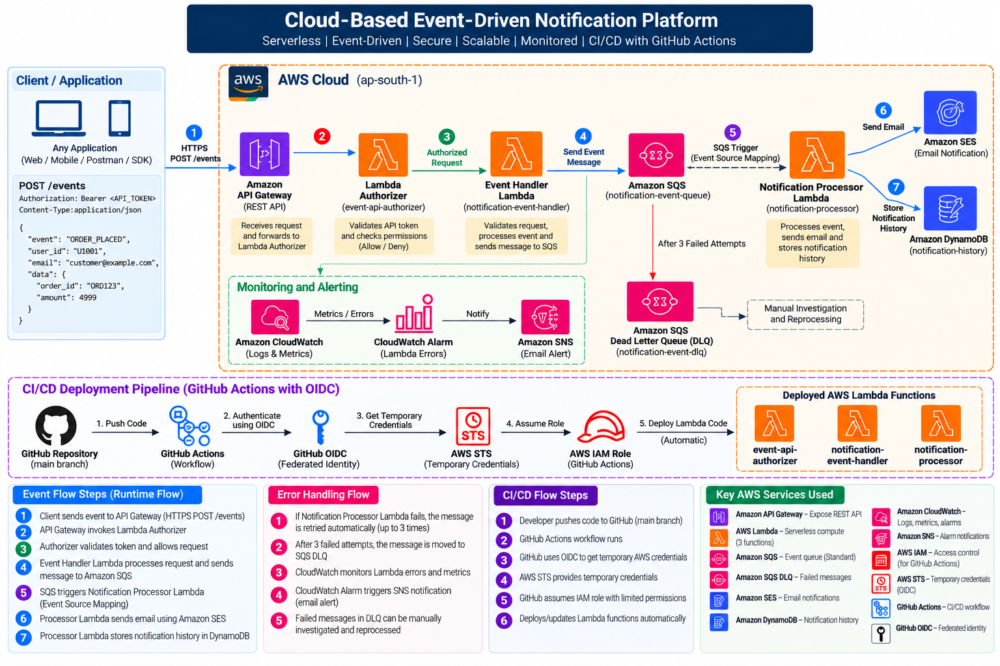
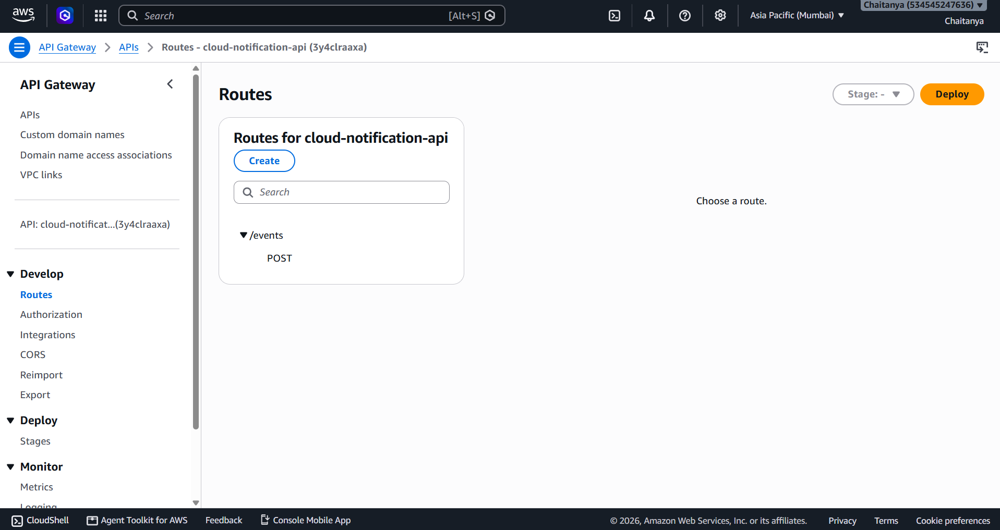
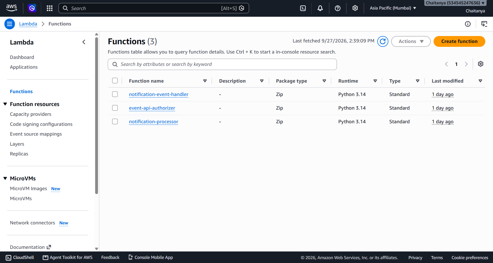
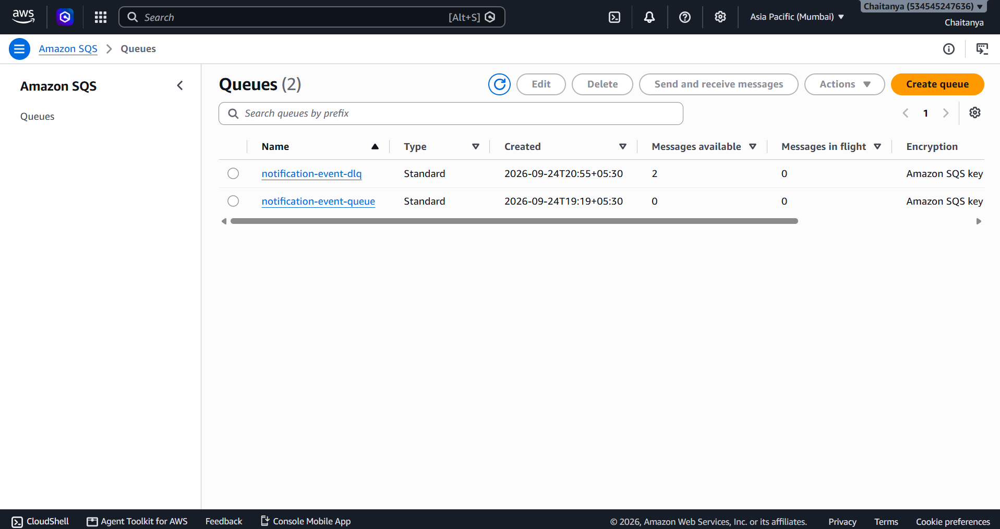
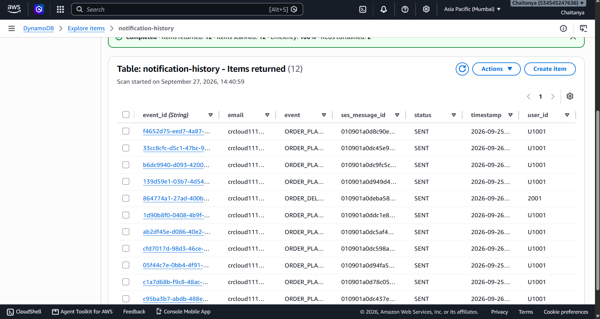
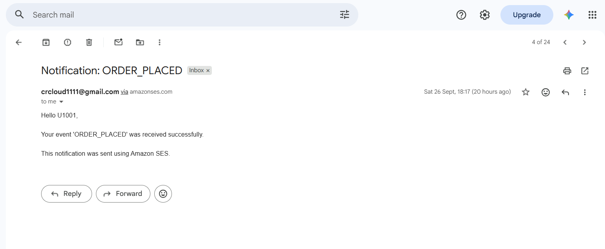
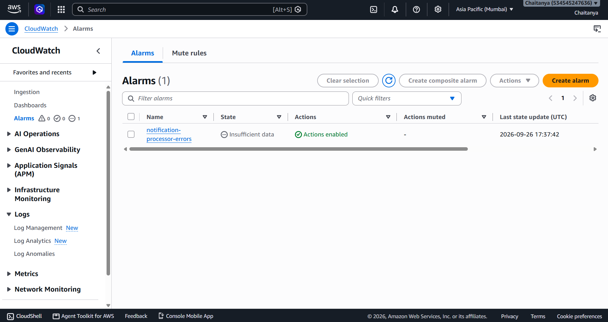
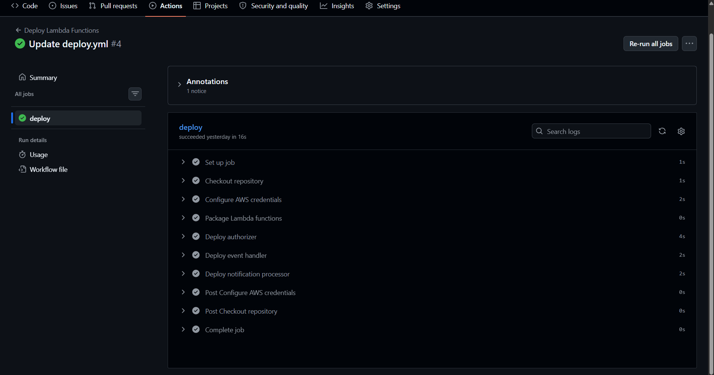

# ☁️ Cloud-Based Event-Driven Notification Platform

A serverless, event-driven notification platform built on AWS that provides a secure and scalable way for applications to trigger email notifications through an HTTP API.

The platform receives business events such as `ORDER_PLACED`, `ORDER_SHIPPED`, `ORDER_DELIVERED`, `PAYMENT_SUCCESS`, and `PAYMENT_FAILED`. Events are processed asynchronously using Amazon SQS, notifications are delivered through Amazon SES, and notification history is stored in Amazon DynamoDB.

The system also includes failure handling using an SQS Dead Letter Queue, monitoring and alerting with Amazon CloudWatch and SNS, and automated Lambda deployment using GitHub Actions with GitHub OIDC.

---

## 🏗️ Architecture



### Architecture Components

```text
Client / Postman
       |
       | HTTPS POST /events
       v
Amazon API Gateway
       |
       v
Lambda Authorizer
       |
       | Authorized Request
       v
Event Handler Lambda
       |
       | SendMessage
       v
Amazon SQS
       |
       | SQS Event Source Mapping
       v
Notification Processor Lambda
       |-----------------------> Amazon SES
       |                              |
       |                              v
       |                       Customer Email
       |
       +-----------------------> Amazon DynamoDB
                                      |
                                      v
                              Notification History


SQS
 |
 | After repeated failures
 v
Dead Letter Queue
 |
 v
Investigation / Reprocessing


Lambda
 |
 v
CloudWatch
 |
 v
CloudWatch Alarm
 |
 v
Amazon SNS
 |
 v
Alert Email
```

### CI/CD Architecture

```text
Developer
    |
    | git push
    v
GitHub Repository
    |
    v
GitHub Actions
    |
    | OIDC Authentication
    v
GitHub OIDC
    |
    v
AWS STS
    |
    v
AWS IAM Deployment Role
    |
    v
AWS Lambda
```

---

# 🎯 Project Objective

Applications such as e-commerce platforms, banking systems, SaaS applications, food delivery systems, and other business applications frequently need to send notifications when an event occurs.

Instead of implementing notification processing directly inside every application, this project provides a separate notification platform that applications can call through an HTTP API.

For example, when an e-commerce customer places an order:

```text
E-Commerce Application
        |
        | ORDER_PLACED
        | user_id + email
        v
Notification API
        |
        v
AWS Event-Driven Platform
        |
        v
Email Notification
```

The external application remains responsible for its users and customer data, while this platform is responsible for processing and delivering notifications.

---

# 🚀 How the System Works

## 1. Client Sends Event

Postman is used as the client for testing the platform.

The client sends an HTTP request to the API Gateway endpoint.

Example:

```http
POST /events
Authorization: Bearer <API_TOKEN>
Content-Type: application/json
```

Request body:

```json
{
  "event": "ORDER_PLACED",
  "user_id": "U1001",
  "email": "customer@example.com"
}
```

Additional application data can also be included:

```json
{
  "event": "ORDER_PLACED",
  "user_id": "U1001",
  "email": "customer@example.com",
  "order_id": "ORD123",
  "product": "Laptop",
  "amount": 49999
}
```

---

## 2. API Gateway

Amazon API Gateway provides the public HTTP endpoint:

```text
POST /events
```

The API is implemented using an **API Gateway HTTP API**.

API Gateway receives the request and passes it through the Lambda Authorizer before allowing the request to reach the Event Handler Lambda.

---

## 3. Lambda Authorizer

The `event-api-authorizer` Lambda protects the API endpoint.

It validates the Bearer token from:

```text
Authorization: Bearer <API_TOKEN>
```

### Valid token

```text
Request
   ↓
Authorizer
   ↓
Authorized
```

### Invalid or missing token

```text
Request
   ↓
Authorizer
   ↓
HTTP 401 Unauthorized
```

The expected API token is stored using a Lambda environment variable.

---

## 4. Event Handler Lambda

The `notification-event-handler` Lambda processes the incoming API request.

Responsibilities include:

- Parsing the JSON request
- Validating required fields
- Validating email format
- Reading the SQS queue URL from an environment variable
- Sending the event to Amazon SQS

Required fields:

```text
event
user_id
email
```

Successful response:

```json
{
  "message": "Event received and queued successfully",
  "message_id": "..."
}
```

The Event Handler Lambda does **not** directly invoke the Notification Processor Lambda.

The communication happens through SQS:

```text
Event Handler Lambda
        |
        v
      SQS
        |
        v
Notification Processor Lambda
```

This provides loose coupling between event ingestion and notification processing.

---

# 📩 Amazon SQS

The platform uses:

```text
notification-event-queue
```

Amazon SQS acts as the asynchronous event buffer.

When the Event Handler Lambda receives a valid request, it places the event into SQS.

The API can return a successful response without waiting for the final email delivery process to complete.

### Benefits of SQS

- Decouples services
- Handles asynchronous processing
- Provides automatic retries
- Helps absorb traffic spikes
- Supports Dead Letter Queue processing

---

# ⚙️ Notification Processor Lambda

The `notification-processor` Lambda is triggered automatically when messages arrive in SQS.

The Lambda:

1. Reads the SQS message
2. Extracts the event details
3. Sends the email using Amazon SES
4. Stores notification history in DynamoDB

The SQS Event Source Mapping connects the queue to the processor.

```text
Amazon SQS
     |
     | Event Source Mapping
     v
Notification Processor Lambda
```

---

# 📧 Amazon SES

Amazon SES is used to send notification emails.

For example:

```text
From:
Verified Sender

To:
customer@example.com
```

The recipient email is supplied dynamically in the event request.

For example:

```json
{
  "event": "ORDER_PLACED",
  "user_id": "U1001",
  "email": "customer@example.com"
}
```

The customer does not need to be manually added to the Lambda code.

The application that knows the customer sends the customer's email to the notification API.

### Example

```text
New Customer
     |
     | Places Order
     v
E-Commerce Application
     |
     | email = customer@example.com
     v
POST /events
     |
     v
API Gateway
     |
     v
Lambda → SQS → Processor Lambda
                     |
                     v
                   SES
                     |
                     v
             customer@example.com
```

### SES Sandbox

During development, SES may operate in Sandbox mode.

In Sandbox mode, recipient addresses generally need to be verified.

For production usage, SES Production Access can be requested from AWS. After approval, the notification platform can send emails to customer addresses without individually verifying every recipient.

---

# 💾 DynamoDB Notification History

Notification processing history is stored in:

```text
notification-history
```

The table uses:

```text
Partition Key:
event_id
```

Stored attributes include:

```text
event_id
event
user_id
email
status
ses_message_id
timestamp
```

Example:

```text
event:          ORDER_PLACED
user_id:        U1001
email:          customer@example.com
status:         SENT
timestamp:      2026-09-26...
```

This provides persistent records of notification processing.

---

# 🔁 Error Handling with Dead Letter Queue

The project uses:

```text
notification-event-dlq
```

If the Notification Processor Lambda fails, Amazon SQS automatically retries the message.

After the configured maximum receive attempts, the message is moved to the DLQ.

```text
Notification Queue
       |
       v
Processor Lambda
       |
       | Failure
       v
Automatic Retry
       |
       | Failure
       v
Automatic Retry
       |
       | Maximum attempts reached
       v
SQS Dead Letter Queue
       |
       v
Investigation / Reprocessing
```

The DLQ failure mechanism was intentionally tested during development by temporarily causing the processor Lambda to fail.

---

# 📊 Monitoring and Alerting

Amazon CloudWatch is used to monitor the Lambda functions.

## CloudWatch Logs

Lambda execution logs are stored in CloudWatch Logs.

The logs help track:

- Event processing
- SQS message IDs
- Event types
- User IDs
- Processing failures
- SES operations

## CloudWatch Alarm

The project includes:

```text
notification-processor-errors
```

The alarm monitors:

```text
Namespace: AWS/Lambda
Metric: Errors
Function: notification-processor
Statistic: Sum
Period: 5 minutes
Threshold: >= 1 error
```

## SNS Alert

When the CloudWatch alarm enters the ALARM state, Amazon SNS sends an email notification to the configured subscription.

This provides an alert when notification processing failures occur.

---

# 🔐 Security

Security controls implemented in this project include:

### API Authorization

A Lambda Authorizer protects the `/events` API.

### IAM Least Privilege

AWS IAM permissions are restricted to the actions required by each component.

Examples include:

```text
SQS SendMessage
SES SendEmail
DynamoDB PutItem
```

### Environment Variables

Configuration values such as:

```text
QUEUE_URL
SENDER_EMAIL
API_AUTH_TOKEN
```

are stored as Lambda environment variables rather than being hard-coded into the source code.

### GitHub OIDC

GitHub Actions authenticates with AWS using GitHub OIDC.

The CI/CD pipeline does not require long-term AWS access keys stored in the repository.

---

# ⚙️ CI/CD with GitHub Actions

GitHub Actions automatically deploys the Lambda functions.

### Deployment Flow

```text
Developer
    |
    | Push Code
    v
GitHub Repository
    |
    v
GitHub Actions
    |
    | OIDC
    v
AWS STS
    |
    v
IAM Deployment Role
    |
    v
Lambda Functions
```

The workflow deploys:

```text
event-api-authorizer
notification-event-handler
notification-processor
```

### CI/CD Benefits

- Automated Lambda deployments
- No manual ZIP uploads
- Repeatable deployment process
- Temporary AWS credentials through OIDC
- IAM-controlled deployment permissions
- Faster development workflow

---

# 📡 API Documentation

## Endpoint

```text
POST https://3y4clraaxa.execute-api.ap-south-1.amazonaws.com/events
```

## Headers

```text
Authorization: Bearer <API_TOKEN>
Content-Type: application/json
```

## Request

```json
{
  "event": "ORDER_PLACED",
  "user_id": "U1001",
  "email": "customer@example.com"
}
```

## Successful Response

```json
{
  "message": "Event received and queued successfully",
  "message_id": "..."
}
```

## Supported Example Events

```text
ORDER_PLACED
ORDER_SHIPPED
ORDER_DELIVERED
PAYMENT_SUCCESS
PAYMENT_FAILED
```

---

# 🧪 Testing

The platform was tested using Postman.

### Valid Request

```text
HTTP 200
Event received and queued successfully
```

### Invalid Request

The Event Handler Lambda validates:

- Missing `event`
- Missing `user_id`
- Missing `email`
- Invalid email address
- Invalid JSON

Invalid requests return HTTP `400`.

### Unauthorized Request

Requests with a missing or invalid API token return:

```text
HTTP 401 Unauthorized
```

### End-to-End Test

A successful event was verified through the complete flow:

```text
Postman
   ↓
API Gateway
   ↓
Lambda Authorizer
   ↓
Event Handler Lambda
   ↓
SQS
   ↓
Notification Processor Lambda
   ↓
Amazon SES
   ↓
Email
```

The notification was also stored in DynamoDB.

### Failure Test

The processor Lambda was intentionally configured to fail to verify:

```text
Lambda Failure
      ↓
SQS Retry
      ↓
SQS Retry
      ↓
SQS Retry
      ↓
DLQ
```

---

# 📸 Project Screenshots

## API Gateway



## Lambda Functions



## SQS Queue and DLQ



## DynamoDB Notification History



## Amazon SES Email



## CloudWatch Monitoring



## GitHub Actions CI/CD



---

# 🛠️ AWS Services Used

| AWS Service | Purpose |
|---|---|
| **Amazon API Gateway** | HTTP API endpoint |
| **AWS Lambda** | Serverless processing |
| **Amazon SQS** | Asynchronous event queue |
| **Amazon SQS DLQ** | Failed message handling |
| **Amazon SES** | Email notifications |
| **Amazon DynamoDB** | Notification history |
| **Amazon CloudWatch** | Logs, metrics and alarms |
| **Amazon SNS** | Monitoring alerts |
| **AWS IAM** | Access control |
| **AWS STS** | Temporary credentials |
| **GitHub Actions** | CI/CD automation |
| **GitHub OIDC** | Secure AWS authentication |

---

# 📁 Project Structure

```text
cloud-event-notification-platform/
│
├── .github/
│   └── workflows/
│       └── deploy.yaml
│
├── docs/
│   ├── architecture.png
│   ├── 01-api-gateway-route.png
│   ├── 02-lambda-functions.png
│   ├── 03-sqs-queues.png
│   ├── 04-dynamodb-history.png
│   ├── 05-ses-email.png
│   ├── 06-cloudwatch-alarm.png
│   └── 07-github-actions-ci-cd.png
│
├── lambdas/
│   ├── authorizer/
│   │   └── lambda_function.py
│   ├── event-handler/
│   │   └── lambda_function.py
│   └── notification-processor/
│       └── lambda_function.py
│
└── README.md
```

---

# 💰 Cost Considerations

The architecture uses primarily serverless and managed AWS services.

The project avoids continuously running infrastructure such as:

- NAT Gateway
- Always-on EC2
- RDS

Actual AWS costs depend on usage, AWS Free Tier eligibility, account credits, service limits, and current AWS pricing.

AWS billing and Free Tier usage should be monitored when running the project.

---

# 🔮 Future Improvements

Possible future improvements include:

- Terraform Infrastructure as Code
- Custom API domain
- Production-grade authentication
- Notification templates
- SMS and push notifications
- Notification status API
- Event priority handling
- Automated integration testing
- Idempotency and duplicate-event handling
- Multi-region deployment
- Advanced retry policies

---

# 👨‍💻 Author

**Chaitanya Raut**

B.E. Information Technology  
Cloud & DevOps

### Technologies

```text
AWS • Python • Lambda • API Gateway • SQS • SES
DynamoDB • CloudWatch • SNS • IAM • GitHub Actions
GitHub OIDC • Docker • Git • Postman
```

---

## ⭐ Project Highlights

- Serverless AWS architecture
- Event-driven and asynchronous processing
- Secure API using Lambda Authorizer
- SQS retry and Dead Letter Queue
- Email notifications using Amazon SES
- DynamoDB notification history
- CloudWatch monitoring and SNS alerts
- IAM least-privilege permissions
- GitHub Actions CI/CD
- GitHub OIDC authentication
- Postman API testing
- End-to-end and failure testing
